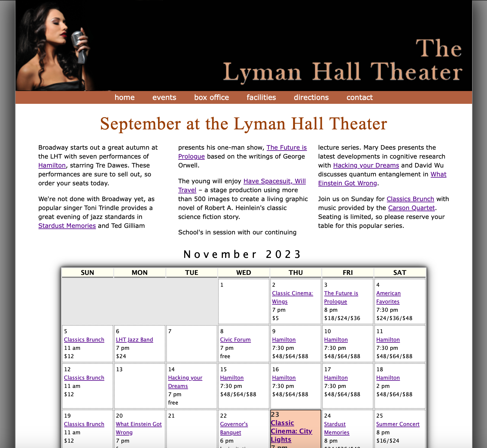

# The Lyman Hall Theater


## Description

This project showcases the schedule for Lyman Hall Theater in September. The website provides information about upcoming events, performances, and lectures scheduled for the month. Additionally, it includes a dynamic calendar generated using JavaScript to highlight the current date.

## Preview



## Features

- **Event Information:** Details about Broadway performances, jazz concerts, science fiction stage productions, and lecture series.
- **Interactive Calendar:** A dynamic calendar generated using JavaScript to highlight the current date.
- **Responsive Design:** The website is designed to be responsive, ensuring a seamless experience on different devices.

## Technologies Used

- HTML5
- CSS3
- JavaScript

## Getting Started

To view the website, simply open the `lht_sept.html` file in a web browser.

```bash
open lht_sept.html

```

## Live Preview

If you prefer a live preview, you can visit the [Lyman Hall Theater - September Schedule](https://ntehseen.github.io/The-Layman-Hall-Theater/#)
## Installation

No installation is required. Simply open the HTML file (`lht_sept.html`) in a web browser.

## License

This project is licensed under the MIT License - see the [LICENSE](LICENSE) file for details.

## Acknowledgments

- [New Perspectives on HTML5 and CSS3, 8th Edition](#) - Tutorial source and inspiration.
